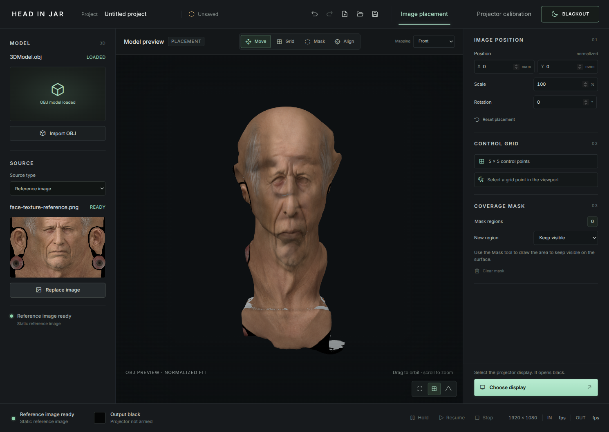
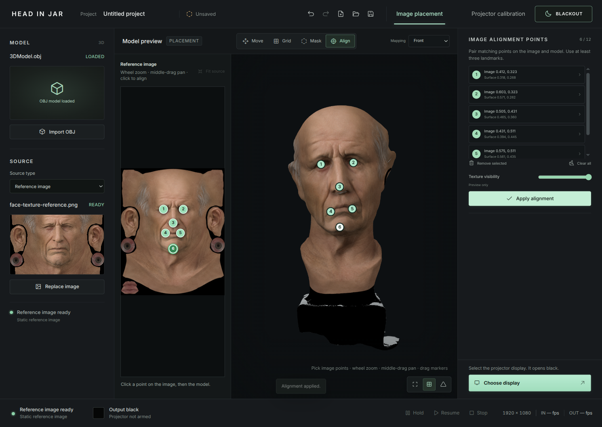
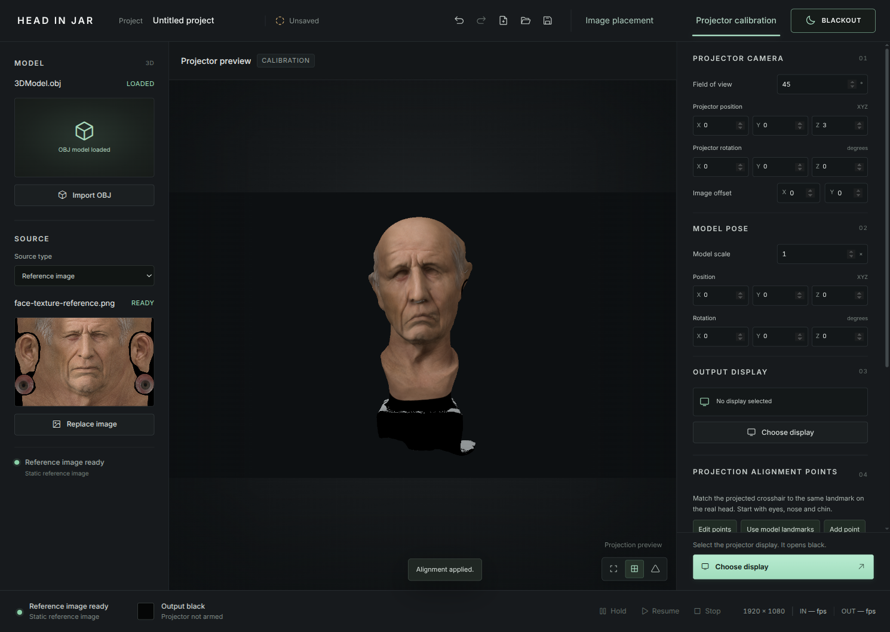

# Head in Jar: First projection mapping project

This walkthrough takes you from a new project to a saved, manually calibrated projection. It uses your own OBJ and reference image; the repository does not include models or sample textures.

## Before you start

- Node.js 22 or later and a desktop environment that can run Electron.
- An OBJ of the physical surface you plan to project onto.
- A still image to align to that model.
- For physical projector calibration, a connected display/projector aimed at the intended object.

From the repository root, install dependencies and start the editor:

```sh
cd app
npm ci
npm start
```



The screenshots use a local model and texture to demonstrate the workflow. The files themselves are not included in the repository.

## 1. Import your model and image

Click **Import OBJ** and choose your model. Under **Source**, set **Source type** to **Reference image**, then click **Add reference image** and choose a still image. The image appears in the editor preview and gives you a source to align.

Keep the reference image at its current path while you work. The project stores a reference to that external file, so moving or deleting it can make it unavailable when you reopen the project.

## 2. Fit the image, then align landmarks

In the toolbar, keep **Image placement** selected and set **Mapping** to **Front**. Front starts on the OBJ's +Z side, which is the initial camera view, and stretches the image around its connected sides and underside. Dragging with **Move** orbits the view; it does not move the image. Use **Image position** for a rough fit, then scale and rotate it there. **Model UV** is for an image atlas prepared for that OBJ's UV layout.

To put one image or live video on another side, choose **Surface**. Orbit the model with **Move**, choose **Place image**, then click or drag on the visible surface. The center handle shows the saved location; the Surface inspector adjusts scale and rotation. Switching back to Front preserves its own alignment settings. A new OBJ clears the Surface location because its coordinates refer to the old model.

For a more accurate fit, choose **Align**. Click a recognizable point on the source image, then the matching point on the model. Add at least three points that are not in a straight line; eyes, nose, mouth corners, and chin are useful face landmarks. The editor automatically calculates a 17 × 17 control grid when the pairs form a valid fit. **Reapply alignment** recalculates it after later changes to the image placement.



Use **Fit source** or **Fit view** if you lose sight of the image or model. This navigation changes the editor view, not the saved mapping.

## 3. Limit the projection with a mask

Choose **Mask**. Set **New region** to **Keep visible** to draw the area that may receive the image, or **Exclude from projection** to cut out an area. Draw the boundary on the model preview and double-click to finish it. Use **Clear mask** to remove all regions.

A mask controls coverage; it does not align the projector with the physical object. Keep this step optional while you are learning the basic fit.

## 4. Calibrate the projector

Choose **Projector calibration**. The visible landmarks from Image placement → Align appear automatically on the model. If there are no landmarks, click **Add point**, then click a recognizable place on the digital model. Add at least three points spread across the surface.

Click **Choose display** in the bottom bar, select the projector, and click **Open black output**. Check that the selected display is the one connected to the projector. When ready, click **Start projection** in the same place.

Select a numbered point. Match its projected cross on the real object by dragging the orange point in the preview. Repeat for the other points, then click **Apply**. To add another point, click **Add point** and pick its place on the digital model.

**Hold** freezes the current projected frame; click it again to continue. **Stop projection** turns the output black. **Freeze preview** holds only the editor preview and does not pause the projected output.



This is a manual 2D correction based on what the operator sees. The editor does not observe the physical object or verify physical accuracy automatically. A single front image also does not contain the sides or back of a head.

## 5. Save and reopen

Click the disk icon in the top bar (**Save project**, also available with Ctrl+S). Choose **Open project** later to reopen the saved project. The OBJ data is stored in the project; keep the external reference image available at its saved path. After restart, output remains black until you click **Start projection**.

## Common issues

- **The image does not fit in Model UV:** switch **Mapping** to **Front** unless you have an atlas made for the model's UVs.
- **The image stays on the original front while orbiting:** orbit changes only the editor camera. Choose **Surface** and **Place image** to move it onto another visible side.
- **The alignment folds or flips:** move the affected point back or remove/recreate the image alignment pair; invalid correction cells are rejected.
- **The preview is aligned but the physical projection is not:** use **Projector calibration** and its physical alignment points. Front → Align fits the image to the digital model only.
- **The projector stays black:** confirm the output display and source, then click **Start projection**. Connecting a live source does not start projection automatically.
- **The reference image is missing after reopening:** restore it to its original path, then reopen or relink it.

For local WebRTC and WHIP input, output controls, project files, and development checks, see the [repository guide](../README.md). The public smoke test uses temporary assets; physical accuracy still requires a run on your own projector and object.
